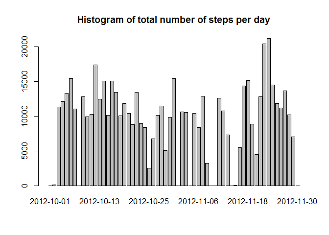
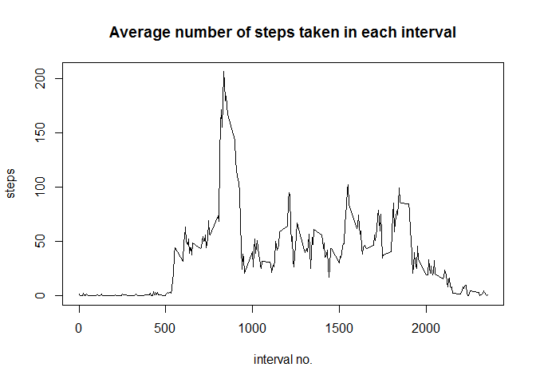
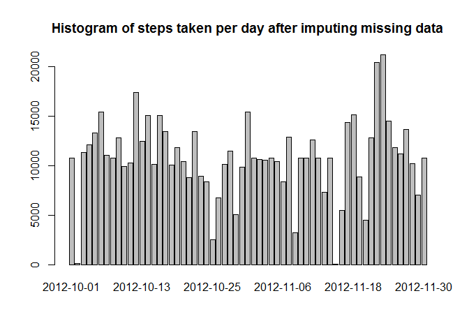
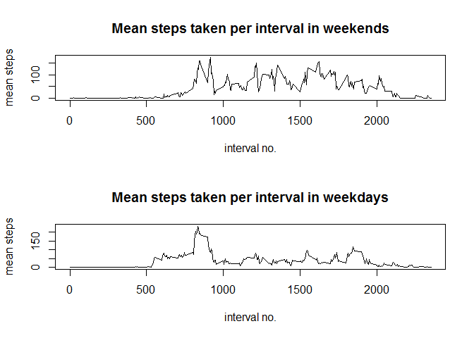

# Reproducible Research: Peer Assessment 1


## Loading and preprocessing the data

```r
activity<-read.csv("activity.csv", header=TRUE)
head(activity)
```

```
##   steps       date interval
## 1    NA 2012-10-01        0
## 2    NA 2012-10-01        5
## 3    NA 2012-10-01       10
## 4    NA 2012-10-01       15
## 5    NA 2012-10-01       20
## 6    NA 2012-10-01       25
```


## What is mean total number of steps taken per day?

### steps per day histogram

```r
step_per_day<-sapply(split(activity$steps, activity$date), sum, na.rm=TRUE)
barplot(step_per_day, main="Histogram of total number of steps per day")
```

 

### mean step per day

```r
mean_step<-mean(step_per_day)
mean_step
```

```
## [1] 9354.23
```

### median step per day

```r
median_step<-median(step_per_day)
median_step
```

```
## [1] 10395
```

## What is the average daily activity pattern?
### step per interval

```r
step_per_interval<-sapply(split(activity$steps, activity$interval), mean, na.rm=TRUE)
plot(names(step_per_interval), step_per_interval, type="l", main="Average number of steps taken in each interval", xlab="interval no.", ylab="steps")
```

 

### interval with maximum steps

```r
which(step_per_interval == max(step_per_interval))
```

```
## 835 
## 104
```


## Imputing missing values
### rows containing NA

```r
num_na<-sum(is.na(activity$step))
num_na
```

```
## [1] 2304
```

### replacing NA values with interval value

```r
activity_no_na<-activity
for(i in 1:length(activity_no_na$steps)){
  if(is.na(activity_no_na$steps[i])){
    activity_no_na$steps[i]<-step_per_interval[i%%288 + 1]
    }
  }
sum(is.na(activity_no_na$steps))
```

```
## [1] 0
```

### Histogram of steps per day for dataset with imputed missing data

```r
step_per_day_no_na<-sapply(split(activity_no_na$steps, activity_no_na$date), sum)
barplot(step_per_day_no_na, main="Histogram of steps taken per day after imputing missing data")
```

 

### mean step per day for the second data set

```r
mean_step_no_na<-mean(step_per_day_no_na)
mean_step_no_na
```

```
## [1] 10766.19
```

### median step per day for the second data set

```r
median_step_no_na<-median(step_per_day_no_na)
median_step_no_na
```

```
## [1] 10766.19
```

### impact on imputing missing data
As can be seen from the mean and median values before and after imputing missing values, these measures have been increased after imuting missing data.


## Are there differences in activity patterns between weekdays and weekends?


```r
act<-activity
act$day<-"weekday"
act$day[weekdays(as.Date(act$date))=="Saturday" | weekdays(as.Date(act$date))=="Sunday"] <- "weekend"
act$day<-as.factor(act$day)
weekends<-act[act$day=="weekend",]
weekdays<-act[act$day=="weekday",]
weekend_step_per_interval<-sapply(split(weekends$steps, weekends$interval), mean, na.rm=TRUE)
weekday_step_per_interval<-sapply(split(weekdays$steps, weekdays$interval), mean, na.rm=TRUE)
par(mfcol=c(2,1))
plot(names(weekend_step_per_interval), weekend_step_per_interval, type="l", main="Mean steps taken per interval in weekends", xlab="interval no.", ylab="mean steps")
plot(names(weekday_step_per_interval), weekday_step_per_interval, type="l", main="Mean steps taken per interval in weekdays", xlab="interval no.", ylab="mean steps")
```

 
